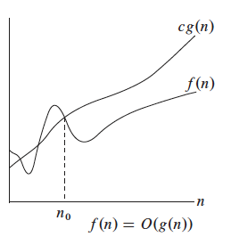
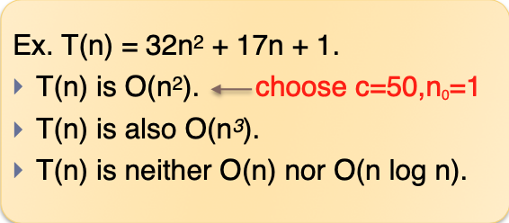
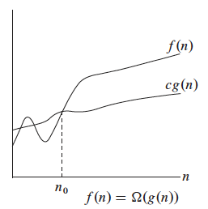
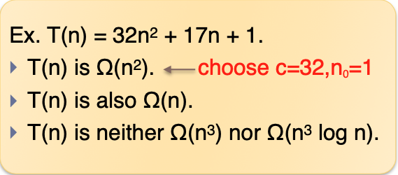
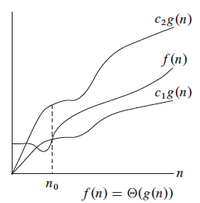
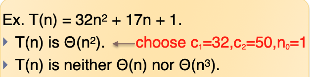

#! https://zhuanlan.zhihu.com/p/516774315

# Asymptotic notation

We will use asymptotic notation primarily to describe the **running times** of algorithms

## Big-Oh

- upper bounds 

- $T(n)$ is  $O(f(n))$,  存在 c > 0 and $n_0$ ≥ 0 满足 **T(n) ≤ c * f(n)** 对于所有 n ≥ $n_0$.

                                             

> Example:
> 
> 

## Big-Omega

- Lower bounds

- $T(n)$ is $Ω(f(n))$, 存在 c>0 and $n_0$ ≥ 0 满足 **T(n) ≥ c * f(n)** 对于所有 n ≥ $n_0$.

                                    

> Example:
> 
> 

## Big-Theta

- Tight bounds

- $T(n)$ is $Θ(f(n))$,  如果存在 
$c_1$ > 0, $c_2$ > 0, $n_0$ ≥ 0, 满足 $c_1 \times f(n) ≤ T(n) ≤ c_2 \times f(n)$ , 对于所有 n ≥ $n_0$.

                                    

> Example:
> 
> 

## 常见的复杂度

$$
\mathrm{O}(1)<\mathrm{O}(\log n)<\mathrm{O}(\sqrt{n})<\mathrm{O}(n)<\mathrm{O}(n \log n)<\mathrm{O}\left(n^{2}\right)<\mathrm{O}\left(2^{n}\right)<\mathrm{O}(n !)
$$

## 均摊复杂度(Amortized Time Complexity)

假设数组的长度是n，在有index的情况下插入, 复杂度是O(1).

当数组满了的时候插入，这个时候需要遍历求和，复杂度是O(n)，

所以根据加权平均计算法，求得的平均时间复杂度是：

## 复杂度震荡

原小概率出现的复杂度出现的概率陡增

比如: 当元素超过边界扩容 和 元素小于界线缩容, 在这个界线反复 add 和 remove
