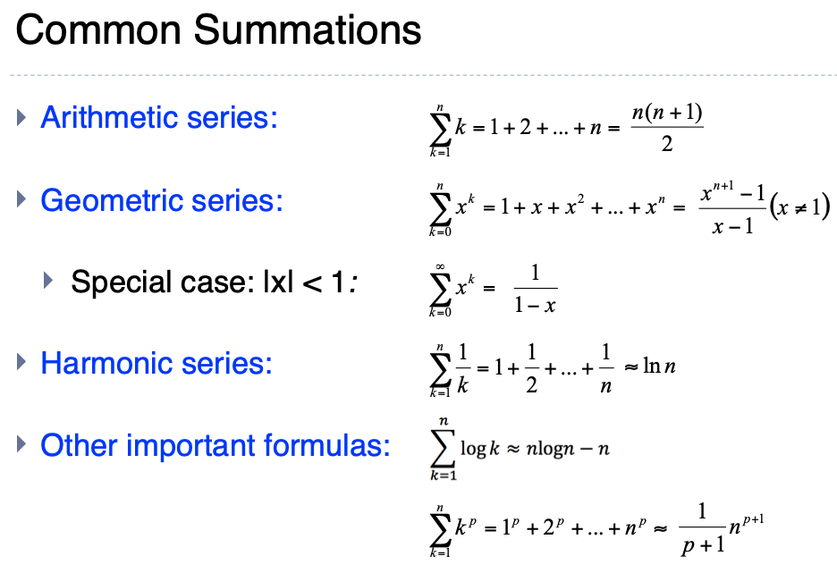
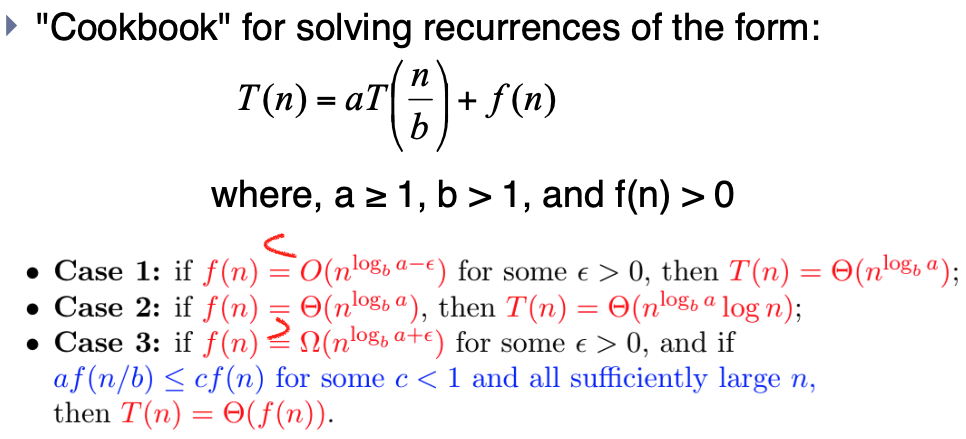
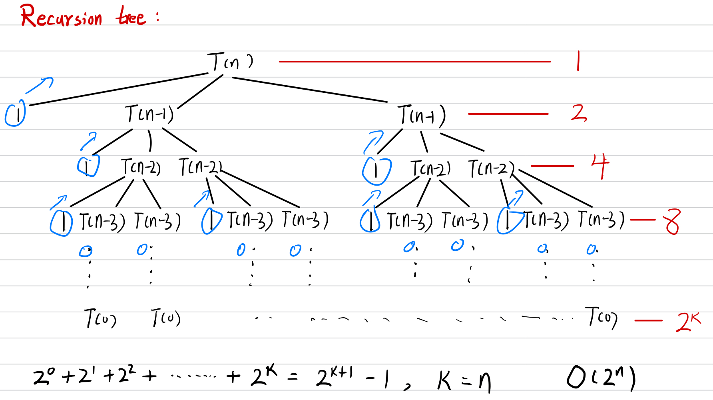
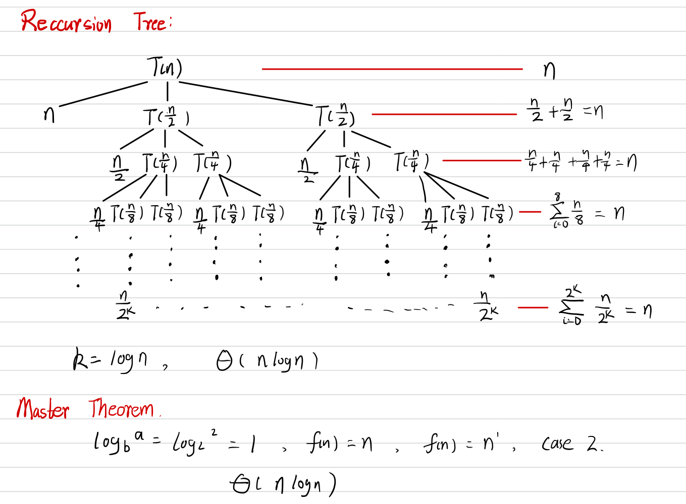

# Recurrences

## 递归

 程序调用自身的编程技巧称为*递归*(recursion)


## 复杂度定义

such as **T(n) = 2T(n/2) + n**. Typically these reflect the runtime of recursive algorithms. For example, the recurrence above would correspond to an algorithm that made two recursive calls on subproblems of size n/c, and then did n units of additional work.

## 三种解法

1. **Substitution method**
   
   Use mathematical induction to find the constants and show that the solution works

2. **Recursion tree**
   
   A recursion tree is a tree where each node represents the cost of a certain recursive subproblem. Then you can sum up the numbers in each node to get the cost of the entire algorithm.
   
   

3. **Master theorem**
   
   

## 例子

递归程序

```java
public static void recurrenceMethod(int n) {  
    for (int i = n; i > 0; i--) {  
        System.out.println("运行还剩 " + i + "次");  
    }  
}
```

### 1. T(n)=2T(n-1)+1

```java
public static void test(int n) {
    System.out.println("程序运行");
    recurrenceMethod(n-1);
    recurrenceMethod(n-1);
}
```



### T(n)= 2T(n/2) +n

```java
public static void test(int n) {
    for (int i = 0; i < n; i++) {
        System.out.println(i);
    }
    recurrenceMethod(n/2);
    recurrenceMethod(n/2);
}
```


