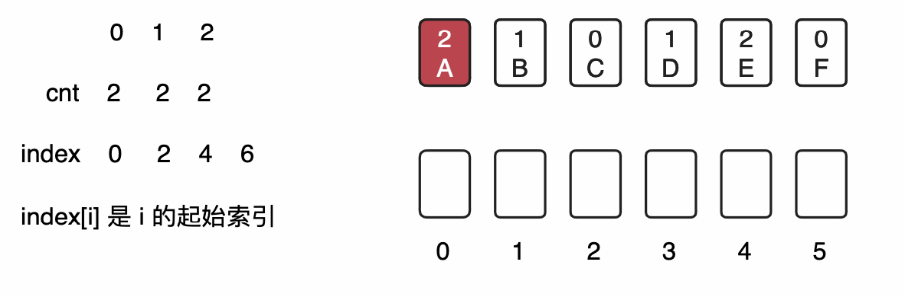

# Counting Sort

## 定义

<u>**构建两个数组：**</u>

1. count 数组， 记录每个元素出现的次数
2. index 数组， 记录每个元素占用的索引 (比 count 大 1)



## 代码

```java
package Sort;

import Utility.Student;

import java.util.Random;

public class CountingSort {

    public static void main(String[] args) {

        int n = 26 * 26 * 26 * 26;

        Student[] students = new Student[n];
        int k = 0;
        Random rnd = new Random();
        for(char c1 = 'a'; c1 <= 'z'; c1 ++)
            for(char c2 = 'a'; c2 <= 'z'; c2 ++)
                for(char c3 = 'a'; c3 <= 'z'; c3 ++)
                    for(char c4 = 'a'; c4 <= 'z'; c4 ++) {
                        students[k] = new Student("" + c1 + c2 + c3 + c4, rnd.nextInt(101));
                        k ++;
                    }

        // 计数排序过程
        int R = 101;

        // O(n)
        int[] cnt = new int[R];
        for(Student student: students)
            cnt[student.getScore()] ++;

        // O(R)
        int[] index = new int[R + 1];
        for(int i = 0; i < R; i ++)
            index[i + 1] = index[i] + cnt[i];

        // O(n)
        Student[] temp = new Student[n];
        for(Student student: students){
            temp[index[student.getScore()]] = student;
            index[student.getScore()] ++;
        }

        // O(n)
        for(int i = 0; i < n; i ++)
            students[i] = temp[i];

        // O(n + R)


        // 验证计数排序算法
        for(int i = 1; i < n; i ++) {
            if (students[i - 1].getScore() > students[i].getScore())
                throw new RuntimeException("Sort failed");

            if(students[i - 1].getScore() == students[i].getScore()){
                if(students[i - 1].getName().compareTo(students[i].getName()) >= 0)
                    throw new RuntimeException("Non-Stable counting sort!");
            }
        }
    }

}

```

## 习题

[75. Sort Colors](https://leetcode.com/problems/sort-colors)

