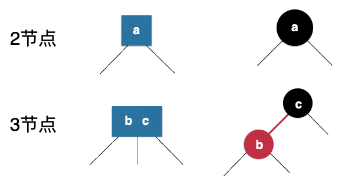
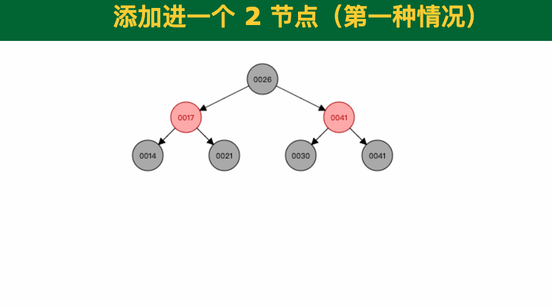
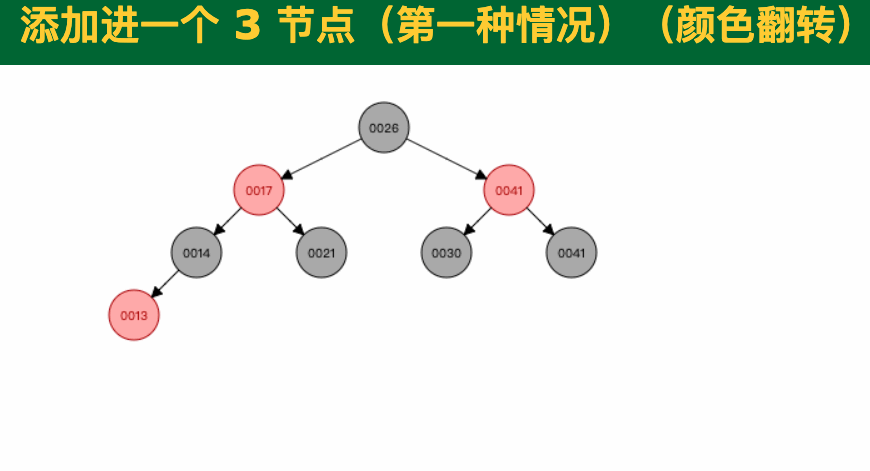
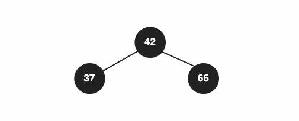
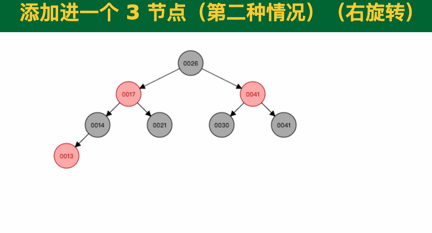
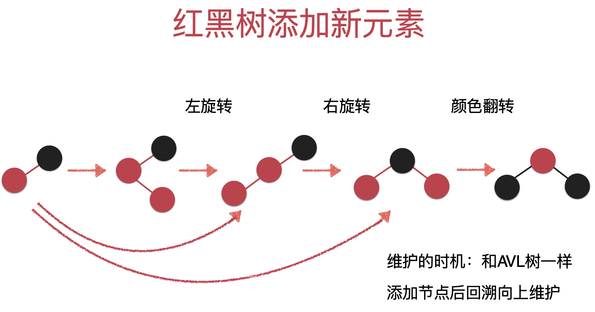

# Red Black Tree

## 基础概念

<u>**定义：**</u>

1. 每个节点或者是红色的，或者是黑色的
2. 根节点是黑色的
3. 每一个叶子节点(最后的空节点)是黑色的
4. 如果一个节点是红色的，那么他的孩子节点都是黑色的 
5. ***从任意一个节点到叶子节点，经过的黑色节点是一样的***

​    

<u>**与 2-3 树联系**</u>





<u>**性质**</u>

- 红⿊树是保持“⿊平衡”的⼆叉树， 严格意义上，不是平衡⼆叉树。

- ***最⼤⾼度：2logn***

  

<u>**保持平衡**</u>

1. 向红黑树添加元素， 新元素默认为***红节点***

    - **添加进 2 节点， 形成一个3节点**（两种情况）

        

    

    

    

    - **添加进 3 节点， 形成一个临时 4 节点**（三种情况）

        

        

        

        

        


## 代码

```java
package DataStructure;

import Utility.FileOperation;

import java.util.ArrayList;

public class RBTree<K extends Comparable<K>, V> {

    private static final boolean RED = true;
    private static final boolean BLACK = false;

    private class Node{
        public K key;
        public V value;
        public Node left, right;
        public boolean color;

        public Node(K key, V value){
            this.key = key;
            this.value = value;
            left = null;
            right = null;
            color = RED;
        }
    }

    private Node root;
    private int size;

    public RBTree(){
        root = null;
        size = 0;
    }

    public int getSize(){
        return size;
    }

    public boolean isEmpty(){
        return size == 0;
    }

    // 判断节点node的颜色
    private boolean isRed(Node node){
        if(node == null)
            return BLACK;
        return node.color;
    }

    //   node                     x
    //  /   \     左旋转         /  \
    // T1   x   --------->   node   T3
    //     / \              /   \
    //    T2 T3            T1   T2
    private Node leftRotate(Node node){

        Node x = node.right;

        // 左旋转
        node.right = x.left;
        x.left = node;

        x.color = node.color;
        node.color = RED;

        return x;
    }

    //     node                   x
    //    /   \     右旋转       /  \
    //   x    T2   ------->   y   node
    //  / \                       /  \
    // y  T1                     T1  T2
    private Node rightRotate(Node node){

        Node x = node.left;

        // 右旋转
        node.left = x.right;
        x.right = node;

        x.color = node.color;
        node.color = RED;

        return x;
    }

    // 颜色翻转
    private void flipColors(Node node){

        node.color = RED;
        node.left.color = BLACK;
        node.right.color = BLACK;
    }

    // 向红黑树中添加新的元素(key, value)
    public void add(K key, V value){
        root = add(root, key, value);
        root.color = BLACK; // 最终根节点为黑色节点
    }

    // 向以node为根的红黑树中插入元素(key, value)，递归算法
    // 返回插入新节点后红黑树的根
    private Node add(Node node, K key, V value){

        if(node == null){
            size ++;
            return new Node(key, value); // 默认插入红色节点
        }

        if(key.compareTo(node.key) < 0)
            node.left = add(node.left, key, value);
        else if(key.compareTo(node.key) > 0)
            node.right = add(node.right, key, value);
        else // key.compareTo(node.key) == 0
            node.value = value;

        if (isRed(node.right) && !isRed(node.left))
            node = leftRotate(node);

        if (isRed(node.left) && isRed(node.left.left))
            node = rightRotate(node);

        if (isRed(node.left) && isRed(node.right))
            flipColors(node);

        return node;
    }

    // 返回以node为根节点的二分搜索树中，key所在的节点
    private Node getNode(Node node, K key){

        if(node == null)
            return null;

        if(key.equals(node.key))
            return node;
        else if(key.compareTo(node.key) < 0)
            return getNode(node.left, key);
        else // if(key.compareTo(node.key) > 0)
            return getNode(node.right, key);
    }

    public boolean contains(K key){
        return getNode(root, key) != null;
    }

    public V get(K key){

        Node node = getNode(root, key);
        return node == null ? null : node.value;
    }

    public void set(K key, V newValue){
        Node node = getNode(root, key);
        if(node == null)
            throw new IllegalArgumentException(key + " doesn't exist!");

        node.value = newValue;
    }

    // 返回以node为根的二分搜索树的最小值所在的节点
    private Node minimum(Node node){
        if(node.left == null)
            return node;
        return minimum(node.left);
    }

    // 删除掉以node为根的二分搜索树中的最小节点
    // 返回删除节点后新的二分搜索树的根
    private Node removeMin(Node node){

        if(node.left == null){
            Node rightNode = node.right;
            node.right = null;
            size --;
            return rightNode;
        }

        node.left = removeMin(node.left);
        return node;
    }

    // 从二分搜索树中删除键为key的节点
    public V remove(K key){

        Node node = getNode(root, key);
        if(node != null){
            root = remove(root, key);
            return node.value;
        }
        return null;
    }

    private Node remove(Node node, K key){

        if( node == null )
            return null;

        if( key.compareTo(node.key) < 0 ){
            node.left = remove(node.left , key);
            return node;
        }
        else if(key.compareTo(node.key) > 0 ){
            node.right = remove(node.right, key);
            return node;
        }
        else{   // key.compareTo(node.key) == 0

            // 待删除节点左子树为空的情况
            if(node.left == null){
                Node rightNode = node.right;
                node.right = null;
                size --;
                return rightNode;
            }

            // 待删除节点右子树为空的情况
            if(node.right == null){
                Node leftNode = node.left;
                node.left = null;
                size --;
                return leftNode;
            }

            // 待删除节点左右子树均不为空的情况

            // 找到比待删除节点大的最小节点, 即待删除节点右子树的最小节点
            // 用这个节点顶替待删除节点的位置
            Node successor = minimum(node.right);
            successor.right = removeMin(node.right);
            successor.left = node.left;

            node.left = node.right = null;

            return successor;
        }
    }

    public static void main(String[] args){

        System.out.println("Pride and Prejudice");

        ArrayList<String> words = new ArrayList<>();
        if(FileOperation.readFile("./src/Utility/pride-and-prejudice.txt", words)) {
            System.out.println("Total words: " + words.size());

            RBTree<String, Integer> map = new RBTree<>();
            for (String word : words) {
                if (map.contains(word))
                    map.set(word, map.get(word) + 1);
                else
                    map.add(word, 1);
            }

            System.out.println("Total different words: " + map.getSize());
            System.out.println("Frequency of PRIDE: " + map.get("pride"));
            System.out.println("Frequency of PREJUDICE: " + map.get("prejudice"));
        }

        System.out.println();
    }
}

```


