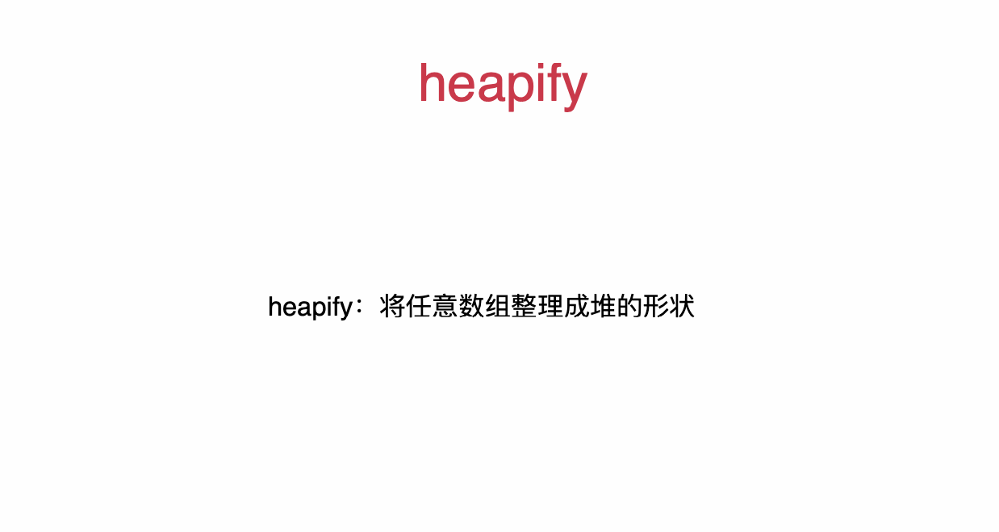
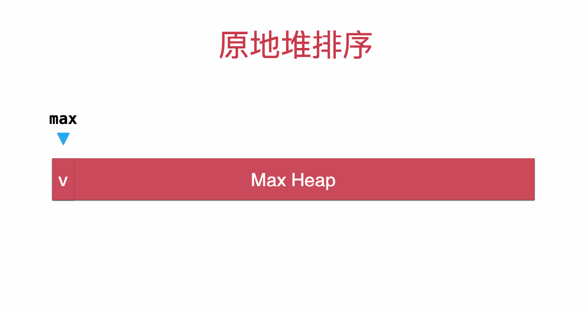

# Heap


**add** 和 **extractMax** 时间复杂度都是 **O(logn)**

heapify的过程，算法复杂度为O(n)

## Sift up (add)


Log(n)

## Sift down (extract)


Log(n)

## Heapify



## HeapSort



## 代码

```java
package DataStructure;

public class MaxHeap<E extends Comparable<E>> {

    private Array<E> data;

    public MaxHeap(int capacity){
        data = new Array<>(capacity);
    }

    public MaxHeap(){
        data = new Array<>();
    }
    // heapify
    public MaxHeap(E[] arr){
        data = new Array<>(arr);
        if(arr.length != 1){
            for(int i = parent(arr.length - 1) ; i >= 0 ; i --)
                siftDown(i);
        }
    }

    // 返回堆中的元素个数
    public int size(){
        return data.getSize();
    }

    // 返回一个布尔值, 表示堆中是否为空
    public boolean isEmpty(){
        return data.isEmpty();
    }

    // 返回完全二叉树的数组表示中，一个索引所表示的元素的父亲节点的索引
    private int parent(int index){
        if(index == 0)
            throw new IllegalArgumentException("index-0 doesn't have parent.");
        return (index - 1) / 2;
    }

    // 返回完全二叉树的数组表示中，一个索引所表示的元素的左孩子节点的索引
    private int leftChild(int index){
        return index * 2 + 1;
    }

    // 返回完全二叉树的数组表示中，一个索引所表示的元素的右孩子节点的索引
    private int rightChild(int index){
        return index * 2 + 2;
    }

    // 向堆中添加元素
    public void add(E e){
        data.addLast(e);
        siftUp(data.getSize() - 1);
    }

    private void siftUp(int k){

        while(k > 0 && data.get(parent(k)).compareTo(data.get(k)) < 0 ){
            data.swap(k, parent(k));
            k = parent(k);
        }
    }

    // 看堆中的最大元素
    public E findMax(){
        if(data.getSize() == 0)
            throw new IllegalArgumentException("Can not findMax when heap is empty.");
        return data.get(0);
    }

    // 取出堆中最大元素
    public E extractMax(){

        E ret = findMax();

        data.swap(0, data.getSize() - 1);
        data.removeLast();
        siftDown(0);

        return ret;
    }

    private void siftDown(int k){

        while(leftChild(k) < data.getSize()){
            int j = leftChild(k); // 在此轮循环中,data[k]和data[j]交换位置
            if( j + 1 < data.getSize() &&
                    data.get(j + 1).compareTo(data.get(j)) > 0 )
                j ++;
            // data[j] 是 leftChild 和 rightChild 中的最大值

            if(data.get(k).compareTo(data.get(j)) >= 0 )
                break;

            data.swap(k, j);
            k = j;
        }
    }

    // 取出堆中的最大元素，并且替换成元素e
    public E replace(E e){

        E ret = findMax();
        data.set(0, e);
        siftDown(0);
        return ret;
    }


}
```

heap sort

```java
package Sort;

import DataStructure.MaxHeap;
import Utility.ArrayGenerator;
import Utility.SortingHelper;

import java.util.Arrays;


public class HeapSort {


    public static <E extends Comparable<E>> void sort(E[] data){

        MaxHeap<E> maxHeap = new MaxHeap<>();
        for(E e: data)
            maxHeap.add(e);

        for(int i = data.length - 1; i >= 0; i --)
            data[i] = maxHeap.extractMax();
    }

    public static <E extends Comparable<E>> void sort2(E[] data){

        if(data.length <= 1) return;

        for(int i = (data.length - 2) / 2 ; i >= 0 ; i --)
            siftDown(data, i, data.length);

        for(int i = data.length - 1; i >= 0; i --){
            swap(data, 0, i);
            siftDown(data, 0, i);
        }
    }

    // 对 data[0, n) 所形成的最大堆中，索引 k 的元素，执行 siftDown
    private static <E extends Comparable<E>>void siftDown(E[] data, int k, int n){

        while(2 * k + 1 < n){
            int j = 2 * k + 1; // 在此轮循环中,data[k]和data[j]交换位置
            if( j + 1 < n && data[j + 1].compareTo(data[j]) > 0 )
                j ++;
            // data[j] 是 leftChild 和 rightChild 中的最大值

            if(data[k].compareTo(data[j]) >= 0 )
                break;

            swap(data, k, j);
            k = j;
        }
    }

    private static <E> void swap(E[] arr, int i, int j){

        E t = arr[i];
        arr[i] = arr[j];
        arr[j] = t;
    }

    public static void main(String[] args) throws Exception {

        int n = 1000000;

        Integer[] arr = ArrayGenerator.generateRandomArray(n, n);
        Integer[] arr2 = Arrays.copyOf(arr, arr.length);
        Integer[] arr3 = Arrays.copyOf(arr, arr.length);
        Integer[] arr4 = Arrays.copyOf(arr, arr.length);
        Integer[] arr5 = Arrays.copyOf(arr, arr.length);

        SortingHelper.sortTest("Sort.MergeSort", arr);
        SortingHelper.sortTest("Sort.QuickSort", arr2);
        SortingHelper.sortTest("Sort.HeapSort", arr4);
    }
}
```
