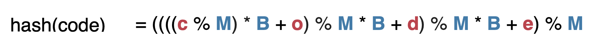
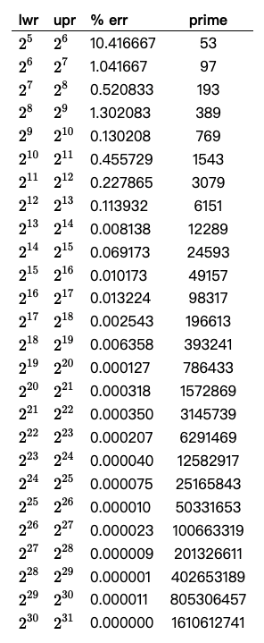

# Hash Table

## 基础

**<u>哈希函数设计</u>**：

例子：code

code = **c** * 26^3 + **o** * 26^2 + **d** * 26^1 + **e** * 26^0
code = **c** * **B**^3 + **o** * **B**^2 + **d** * **B**^1 + **e** * **B**^0
hash(code) = ( **c** * **B**^3 + **o** * **B**^2 + **d** * **B**^1 + **e** * **B**^0 ) % **M**



<u>**哈希素数表：**</u>



<u>**哈希性质**</u>

1. 一致性:如果a==b，则hash(a) == hash(b) 
2. 高效性:计算高效简便
3. 均匀性:哈希值均匀分布
4. 均摊复杂度 O（1）


**<u>解决哈希冲突：</u>**

1. Chaining
2. Open addressing
    1. Linear probing 
    2. Quadratic probing 
    3. Double hashing


## 代码

```java
package Algorithm;

import java.util.TreeMap;

public class HashTable<K extends Comparable<K>, V> {

    private final int[] capacity
            = {53, 97, 193, 389, 769, 1543, 3079, 6151, 12289, 24593,
            49157, 98317, 196613, 393241, 786433, 1572869, 3145739, 6291469,
            12582917, 25165843, 50331653, 100663319, 201326611, 402653189, 805306457, 1610612741};

    private static final int upperTol = 10;
    private static final int lowerTol = 2;
    private int capacityIndex = 0;

    private TreeMap<K, V>[] hashtable;
    private int size;
    private int M;

    public HashTable(){
        this.M = capacity[capacityIndex];
        size = 0;
        hashtable = new TreeMap[M];
        for(int i = 0 ; i < M ; i ++)
            hashtable[i] = new TreeMap<>();
    }

    private int hash(K key){
        return (key.hashCode() & 0x7fffffff) % M;
    }

    public int getSize(){
        return size;
    }

    public void add(K key, V value){
        TreeMap<K, V> map = hashtable[hash(key)];
        if(map.containsKey(key))
            map.put(key, value);
        else{
            map.put(key, value);
            size ++;

            if(size >= upperTol * M && capacityIndex + 1 < capacity.length){
                capacityIndex ++;
                resize(capacity[capacityIndex]);
            }
        }
    }

    public V remove(K key){
        V ret = null;
        TreeMap<K, V> map = hashtable[hash(key)];
        if(map.containsKey(key)){
            ret = map.remove(key);
            size --;

            if(size < lowerTol * M && capacityIndex - 1 >= 0){
                capacityIndex --;
                resize(capacity[capacityIndex]);
            }
        }
        return ret;
    }

    public void set(K key, V value){
        TreeMap<K, V> map = hashtable[hash(key)];
        if(!map.containsKey(key))
            throw new IllegalArgumentException(key + " doesn't exist!");

        map.put(key, value);
    }

    public boolean contains(K key){
        return hashtable[hash(key)].containsKey(key);
    }

    public V get(K key){
        return hashtable[hash(key)].get(key);
    }

    private void resize(int newM){
        TreeMap<K, V>[] newHashTable = new TreeMap[newM];
        for(int i = 0 ; i < newM ; i ++)
            newHashTable[i] = new TreeMap<>();

        int oldM = M;
        this.M = newM;
        for(int i = 0 ; i < oldM ; i ++){
            TreeMap<K, V> map = hashtable[i];
            for(K key: map.keySet())
                newHashTable[hash(key)].put(key, map.get(key));
        }

        this.hashtable = newHashTable;
    }
}
```

